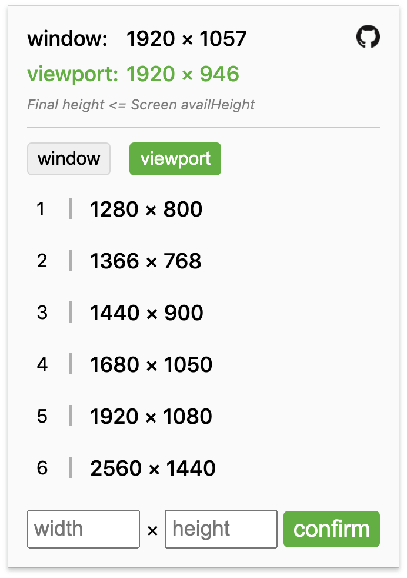

# View-Resizer (视窗大小调整chrome插件)  
Window and Viewport Resizer - chrome extension  
可以调整改变浏览器窗口或可视窗口的大小

### screenshots
  

#### Sponsor [Coffee Sponsorship Links](https://github.com/kongkong99/sponsor/blob/main/README.md)
**If you think my content is very useful to you, you can sponsor me a cup of coffee, thank you!**
